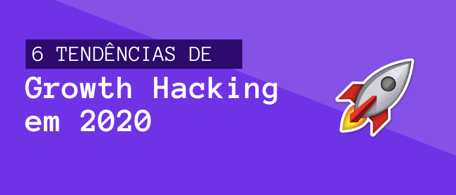

Este artigo tem como base as recentes publicações do Felipe Witt ([@felipewitt](https://www.instagram.com/felipewitt/)), Head of Growth da [EmCasa](https://www.emcasa.com/), startup que cresceu 15x em 2019. Se você tem interesse em conteúdos atualizados e de qualidade sobre a área, recomendo fortemente que acompanhe o trabalho dele [no Instagram](https://www.instagram.com/felipewitt/).

### 1. Growth ≠ experimentos

Em primeiro lugar, há uma visão errônea comumente atribuída ao growth, que é defini-lo apenas por experimentos. Na verdade, o growth hoje deve ser visto como um mecanismo (ou *growth engine*) que você desenvolve para analisar a empresa e identificar alavancas para acelerar o crescimento.

### 2. Retenção é o que diferencia as top 1% startups das 99% demais

Um dos fatores que torna a retenção uma métrica extremamente importante está no fato de que ela influencia diretamente no aumento do LTV (Lifetime Value) do seu cliente. Isso significa que quanto maior for o tempo que você retém um usuário, maior será o LTV dele, e um LTV maior aumenta sua tolerância em relação ao CAC (custo por aquisição). Assim, quanto maior for a receita gerada pelo usuário (por um maior período de tempo possível), mais você poderá investir na aquisição de novos clientes.

O segundo motivo é que uma boa retenção diminui o tempo de payback, ou seja, o tempo necessário para recuperar o investimento feito para adquirir o cliente. Nessa situação, um questionamento comum é que este tempo de payback pode ser considerado relativamente longo, tendo que em vista que é uma conta feita a partir de um usuário único. Mas se você fizer a conta de todo o cohort de usuários retidos, quanto maior for esse grupo, mais receita você gera, o que possibilita pagar o valor gasto para adquiri-los no menor tempo possível.

Um outro ponto é que a  retenção está ligada ao engajamento, algo que determina o modelo de negócio. Quanto mais engajado está seu usário, melhor será sua receita. Exemplo do iFood: se você tem um usuário que engaja uma vez por mês, e o ticket é R$ 50,00, são R$ 50,00 de recorrência por mês. Agora, se o seu usuário engaja 4 vezes e o ticket é R$ 25,00, você terá uma recorrência de R$ 100,00 por mês.

### 3. Monetização não se resume a preço

Um dos maiores exemplos de estratégia de monetização que resultou em um crescimento explosivo é o do Slack, conforme mostra [este estudo de caso](https://www.singlegrain.com/casestudies/growth-study-slack-the-fastest-business-app-growth-in-history/) publicado pela Single Grain. 

Resumidamente, um dos fatores que influenciou no sucesso do Slack foi a estratégia de monetização, que consiste em um modelo freemium com features generosas, permitindo times inteiros experimentarem o valor gerado pela ferramenta antes de decidirem contratar o plano completo. 

Isso fez com que o Slack se tornasse um software com uma das melhores taxas de conversão do mercado de freemiums, com um valor expressivo de **30%**. Hoje o Slack conta com uma user base de [8 milhões de usuários ativos](https://www.statista.com/chart/6643/daily-active-users-of-slack/), sendo que destes, 3 milhões são pagantes.

Assim, podemos definir a monetização como uma combinação de 4 fatores diferentes:

→ **Como** você cobra: anúncios, assinatura, transação⁠⁠

→ **Quando** você cobra: antecipado, free trial, freemium⁠⁠

→ **O que** você cobra: contatos, API, features

→ **O valor** que você cobra⁠ efetivamente

### 4. Olhar para a aquisição em termos de *loops*, e não de funil

O clássico funil de conversão amplamente utilizado já não é mais suficiente para consolidar uma boa estratégia de marketing digital. Isso porque ele representa uma visão linear sobre a aquisição de usuários com times trabalhando em etapas, com foco em resultados do mês, ao invés considerar os resultados compostos.

Um loop é um fluxo que se retroalimenta, isso significa que um cohort de usuários alimenta o próximo cohort, com efeito composto sobre o crescimento, é um modelo mais defensável.⁠

Um mesmo canal de aquisição pode ou não ser um loop de acordo com seu negócio. Considere "PR" para o Catarse (crowdfunding).⁠
⁠
Exemplo do Catarse:⁠
⁠

1. Os projetos servem de material para a imprensa⁠
2. Os materiais geram novas visitas⁠
3. Com mais visitas, aumenta o total de doadores⁠
4. Com mais doadores, mais projetos bem sucedidos.⁠
5. Com mais projetos bem sucedidos, aumenta o número de novos captadores⁠
6. Com mais captadores, mais projetos que servem como materiais para a imprensa.⁠

Um loop não é uma indicação, mas um conjunto de ações dos usuários que influenciam na aquisição do novo cohort de usuários.⁠

Entre outros motivos, é por isso que determinadas startups são mais bem sucedidas do que outras na exploração de um determinado canal.

### 5. ELMR Framework: Psicologia do usuário

/// Já parou para pensar no *por quê* as pessoas fazem o que fazem? ///

### 6. The Game has Changed

/// Falar sobre o famoso case do Dropbox, do Outlook ///